<h1 align="center">sol</h1>

<p align="center">
  <b>Your desktop is the solar system.</b><br>
  A workspace model for <a href="https://github.com/malbiruk/driftwm">driftwm</a> —
  the Sun at the origin, eight planets in the order you learned as a child,
  and everything you already know about them doing the navigating for you.
</p>

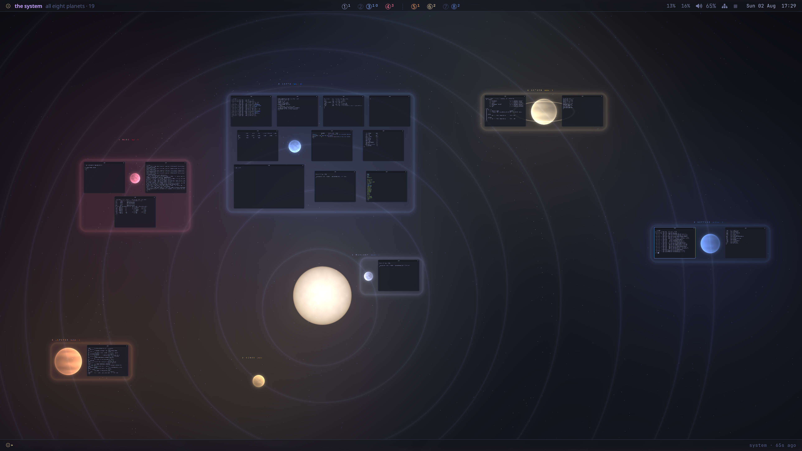

<p align="center"><i>Nineteen windows, six planets. Every district sits on a card in its planet's colour,
so a busy world reads as busy from across the system.</i></p>

---

## The idea

[driftwm](https://github.com/malbiruk/driftwm) gives you an infinite canvas: windows live anywhere on
an endless plane and the screen is a camera looking at it. It's a lovely idea with one honest
problem — **an infinite plane is featureless**. Pan away from your windows and nothing tells you
where you are, which way is home, or where you left that terminal.

`sol` answers that by making the canvas a place you already know. Not a metaphor you have to learn —
*the* solar system, the one you can already recite.

**The Sun sits at a focus of eight real ellipses, and the planets sit where they really were**, one
per orbit, ordered outward: Mercury, Venus, Earth, Mars, the asteroid belt, Jupiter, Saturn, Uranus,
Neptune. Each one is placed by solving Kepler's equation for the date, so it rides its own orbit
line at the angle it actually occupied. `mod+1` … `mod+8` fly you to them in that same order.
`mod+0` returns to the Sun.

And the layout means something:

> **Distance from the Sun is distance from your attention.**
> Inner planets are immediate and ephemeral, the asteroid belt divides, outer planets are heavy and
> background.

| | | |
|---|---|---|
| **1 Mercury** — quick | **2 Venus** — comms | **3 Earth** — home |
| **4 Mars** — ops | · · · *asteroid belt* · · · | **5 Jupiter** — builds |
| **6 Saturn** — media | **7 Uranus** — spare | **8 Neptune** — archive |

Those roles are only defaults; what matters is that "further out" always means "further from what
I'm doing right now".

`mod+0` always comes back here — the Sun, home base, with Mercury a hop away and Earth just below.

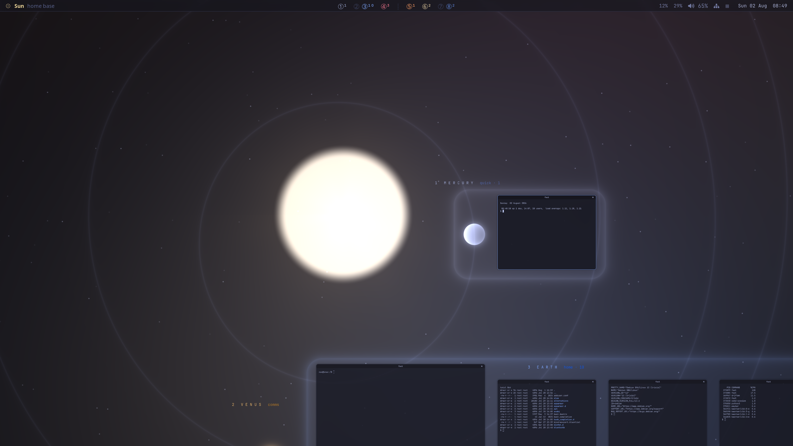

## The one rule

**The camera moves only when you ask it to.** Every automatic camera move driftwm offers is switched
off: new windows don't drag the view, opening a window doesn't reset your zoom, closing one doesn't
pan somewhere, and nothing wanders while you're reading.

When the view does move, it **travels**. Every flight is an eased path streamed at 90 Hz, so you
always see where you went — which is what makes a large canvas navigable instead of disorienting.

## Controls

Press **`mod+/`** at any time for this card on screen.

| Go | | Carry | |
|---|---|---|---|
| `mod+1` … `mod+8` | fly to a planet | `mod+ctrl+1` … `8` | send the focused window to a planet |
| `mod+0` | fly to the Sun | **A crowded planet** | |
| `mod+left` / `mod+right` | sunward / outward | `mod+a` | tidy this planet into a grid |
| `mod+u` | whole system view | `mod+n` / `mod+p` | step through its windows |
| `mod+e` | the overview | `mod+shift+left` / `right` | move it a slot along the grid |
| `mod+tab` | fly-to menu | **Do** | |
| `mod+;` | the command line | `mod+return` `mod+space` | terminal · launcher |
| drag a window | to another planet | `mod+q` `mod+f` `mod+m` | close · fullscreen · maximise |

Drag to pan, scroll to pan, pinch to zoom — and when you're zoomed out past 45%, clicking any window
flies you to it.

**Four fingers travel the system**, borrowing the muscle memory you already have for switching
desktops. Three fingers still pan and two still zoom, so nothing you already do changes:

| | |
|---|---|
| swipe left / right | the next planet outward / sunward |
| swipe up | the whole system |
| swipe down | back to the Sun |
| pinch in / out | pull back to the system · drop into where you are |
| four-finger hold | tidy this planet |

On a mouse, every click borrows a habit you already have, and does what that habit expects:

- **The numbers in the bar are buttons.** Click `③` and you are on Earth — the same gesture as
  clicking a workspace number in any bar since i3. This is where "click to switch" has always
  lived, so it is the only place a plain click means travel.
- **Right-click acts on what is under the pointer**, as right-click has since desktops began: tidy
  this planet, step through its windows, *new terminal here* — the oldest right-click item there is,
  and since new windows land under the cursor, "here" is exactly where you clicked. Travel sits
  behind one labelled door, "Go to a planet…", instead of being what the menu is. It **opens down
  and to the right of the pointer**, **flips up or left** rather than hang off an edge, and
  **closes when you click away** — the three things that make a context menu one, and the three a
  launcher cannot do. Each item carries its keyboard equivalent down the right, the way a menu
  teaches you to stop needing it.
- **It is the same menu at every zoom, and it answers for what you pointed at.** Right-click Jupiter
  from the whole-system view and the menu says Jupiter — its windows, its tidy, its step, and *Go to
  Jupiter* first — at the size it always is, under your hand, where you clicked.
- **Middle-click the sky opens the overview** — middle-on-the-root has meant the window list since
  X11 had root menus, and the overview is the window list.
- **On a window, sol binds nothing without a modifier.** Middle-click is paste and stays paste;
  `alt+left` moves and `alt+right` resizes, as they do on every Linux desktop.
- **From far out, clicking a window flies you to it** — direct manipulation: touch the thing you
  are looking at.

driftwm has no double-click trigger, so "double-click a planet to go there" is one habit the canvas
cannot borrow; the bar's buttons and click-to-fly cover the same instinct.

## When a planet fills up

Ten terminals on Earth used to be ten terminals in a heap, each one 28 pixels down and to the right
of the last. Now a planet holds a **district**, and sol knows what is in it:

- **`mod+a` tidies it** into justified rows around the planet, shaped to your screen, with the name
  plate lifted clear above. The planet's own disc is reserved as a cell, so windows flow *around* it
  and it is never buried — from across the system a district reads as a lit world nested in its
  work. Rows rather than a ring of moons because rows are compact — orbits here are 820 apart while
  a terminal is 700 wide — and because a block shaped like your screen frames at a zoom where the
  windows are still *usable*, not merely visible.
- **The district gets a card**: a rounded panel in the planet's colour, painted behind the windows
  by the shader. `sol arrange` writes the rectangles into `sol.glsl` between two markers and reloads
  the config, which keeps your camera, windows and focus exactly as they were.
- **The focused window comes forward** and the rest sit a touch back, at 90% opacity.
- **`mod+3` frames the whole district** when it no longer fits at working zoom, so you arrive seeing
  everything Earth is holding. Press `mod+3` again from that overview and you drop into your window
  to get to work; press it again and you are back to the overview.
- **`mod+n` / `mod+p` step through** them one at a time, flying to each.
- **The bar and the overview count them**, so a busy planet reads as busy from across the system.

A window belongs where you put it. `mod+ctrl+3` and `mod+a` write that down, which matters because a
tidy district is wider than the gap between planets — without it the far corner of Earth's grid
would defect to Mercury.

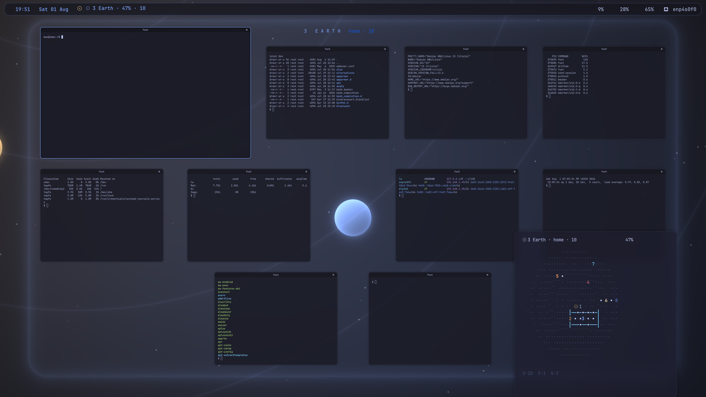

## Carrying one there by hand

**Drag a window onto another planet and let go.** driftwm has always let you move a window anywhere
on the canvas; what it cannot know is that Jupiter is a place. So sol watches for the drop, and
finishes the journey:

- **The room makes space first.** Jupiter's grid slides apart to open the slot nearest where you
  dropped, while the window waits where you left it.
- **Then it crosses**, on a path that bows away from the Sun. It is making a transfer between two
  orbits, and a transfer is not a straight line.
- **The district it left closes the gap** behind it, and both cards reflow.

Drop it back inside its own district instead and it takes the slot you dropped it on, shuffling the
others around it — which is how you order a grid. `mod+shift+left` / `mod+shift+right` move the
focused window one slot without touching the mouse.

Underneath all of it is one change: **windows travel now.** They used to jump to their new positions;
they are streamed along an eased path at 90 Hz, the same way the camera has always moved. `mod+a` is
worth watching for that reason alone.

## When a planet fills right up

A grid can only grow so far before framing it puts the windows below the size at which they are any
use — and driftwm's IPC has no resize, so shrinking them to fit is not on the table. What is left is
to stop laying all of them out.

So the grid holds the **twelve most recently used** and the rest collapse into a **stack** at its
corner: offset, dimmed, each one a step further back than the last. They are still there, still
counted, still reachable with `mod+n` — and touching one brings it to the front while the
least-recent drops onto the pile. The bar and the plate read `home · 12 + 5`, so you can see the
shape of it without going and looking.

The order a drag or `mod+shift+left` writes is the same order that decides this, so how a district is
arranged and how recently you used things are one mechanism rather than two.

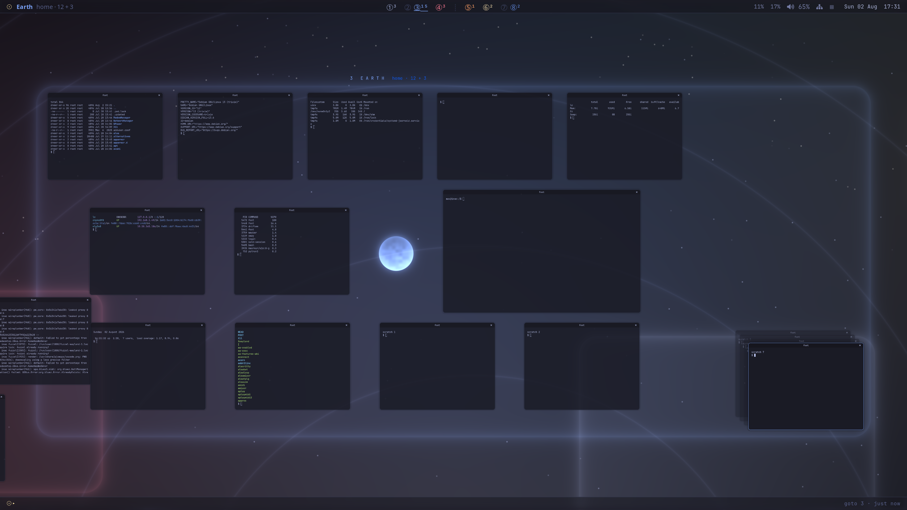

## What you see

**The canvas** is a single GLSL fragment shader: the Sun with its corona, eight orbit ellipses drawn
with the Sun at a focus — so Mercury's is visibly off-centre and Venus's is not — planets lit with a
real day/night terminator facing the Sun, Saturn's ring, a sparse asteroid belt, and a parallaxed
starfield. Each world wears the face its own kind has — the gas giants banded along their
latitudes, crowding towards the poles the way projected latitudes really do; the rocky ones blotched
where their surfaces differ; Venus almost blank, because Venus is almost blank. Every orbit is a soft hairline with a faint bloom and no hard edge, held at a constant
weight in screen pixels so it never thickens as you pull back. Each planet pools its colour into the
space around it, and each district gets a rounded card in that colour behind its windows. It costs
no windows and no meaningful CPU.

It also **gets out of your way**: at working zoom the astronomy fades to a whisper behind your
windows, and blooms as you pull back — so the same canvas is a clean workspace up close and a map
from far away.

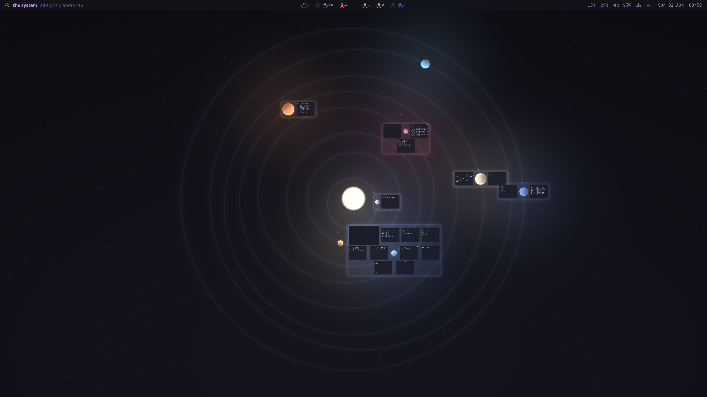

**The overview** (`mod+e`) is the whole system at a size that can actually answer something: every
orbit drawn as a fine dotted ellipse, every district as a card, every window as a mark inside it,
and a pane naming what the planet you picked is holding. `1`…`8` fly, `↑``↓` pick a window, `⏎`
drops you into it, `a` tidies the planet, and clicking anywhere flies there. Press `mod+e` again, or
`esc`, and it is gone.

It replaced a small live map that sat in the bottom-right corner of every screen. That map was forty
cells by twenty for the entire solar system — four hundred canvas units to the cell, which put
neighbouring orbits two cells apart, squashed a whole district into two rows, and left nowhere to
say what any window was. It drew the shape of a system you already knew by heart and none of what
you would open a map for, and it did it on top of your windows, all day. **Asking for it is what
makes it worth having**: nothing is parked, so it can take the room it needs to be legible.

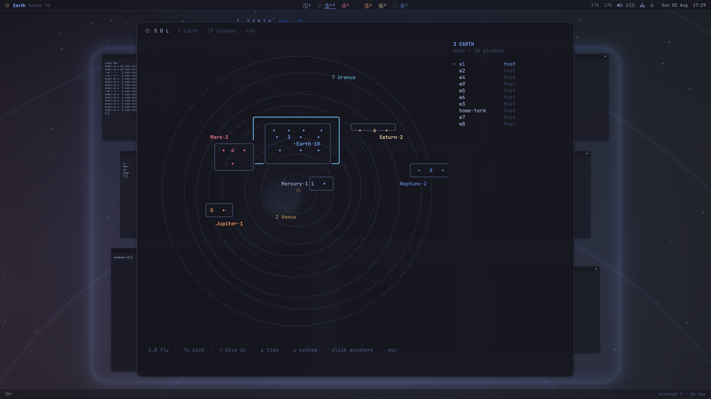

**The bar** borrows the grammar of the macOS menu bar, because the mapping turns out to be exact:
the planet you are standing on is the frontmost application. So `☉` sits where  sits and opens
what  opens, the place is named in **bold** where the app name goes — "Earth", "Saturn", "the
system", "deep space", in that planet's colour — and what it holds ("home · 10") reads as that app's
menus. Status sits on the right, monochrome and quiet, then Control Centre, then the clock last.

In the middle is **the strip**: all eight planets at once, `①②③④ ┊ ⑤⑥⑦⑧`, each in its own colour with
a small tally, dim when empty, underlined where you are. It is ordinal rather than spatial on
purpose — nobody flies by angle, they fly by number — and the belt keeps its place in the middle as
the divide it is. **Each number is a button**: click it and you are there, exactly as a workspace
number has worked in every bar since i3. Scroll anywhere on the strip to travel sunward and outward,
the way you scroll a volume icon.

Only one module in the bar ever asks driftwm anything. `sol here` runs once a second, and leaves the
other modules' answers in a file for them to read, so eight planets' worth of tally costs one query.

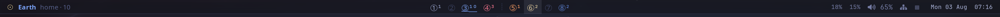

**The `☉` menu** is the one at the far left, and it holds what  holds: the operations that belong
to the machine rather than to anything on it — lock screen, sleep, restart, shut down, log out. It
drops from the bar, left-aligned under the glyph, because that is what a menu-bar menu does. The
three that would lose unsaved work end in an ellipsis and ask again before doing anything, so
nothing below that line happens on a single misclick. The commands are systemd's and swaylock's;
`POWER` at the top of that section in `bin/sol` is the only place that knows them.

**The context menu** is what right-clicking the sky means, and what right-clicking `☉` gives you: a
menu for the place under your pointer — tidy it, step through it, open a terminal here — with
travel behind one labelled "Go to a planet…" item. `mod+tab` skips straight to that switcher:
every place, what it holds, type to filter.

The menu is **not a window on the canvas**. It was one, and everything that is true of a menu had to
be bought back one fix at a time: its font divided by the zoom so it would not grow, a fade to hide
the animated move into place, a pinned twin for the altitudes where driftwm stops delivering clicks
to canvas windows at all. Four fixes deep it was still a different menu at every zoom — because a
menu is a screen-space object and the canvas is not screen space.

So `sol-menu` is a **layer-shell surface**, the same kind of surface the bar is, which the canvas
neither scales nor swallows clicks for. There is no zoom arithmetic left in it, no pinned fallback
and nothing to undo: one menu, the same size and in the same place relative to your hand, at 7% and
at 100%. It flips up or left rather than hang off an edge, closes when you click away — a
full-screen transparent overlay is what a menu grab is — and fades in over a tenth of a second where
it landed. It also carries an `✕`, which no desktop's context menu does: clicking away is the way
out and always was, but a way out you cannot see is one you have to be told about, so there is one
you can see. It is the same grey as the keyboard hints until the pointer is on it.

What that costs is knowing where the pointer is, because a layer surface is not told. driftwm has no
IPC for the cursor, and a surface that maps under a motionless pointer is sent no enter event to
learn from. But driftwm centres the first window of a spawn on the cursor that started it — so the
menu opens a **1×1 window nobody can see**, reads back where the compositor put it, and closes it
again. That is the same trick the old menu ran on itself; the difference is that the thing being
measured is no longer the thing being shown, which is what frees the menu from the canvas.

And because the pointer is now known as a point rather than inferred from the camera, the menu can
answer for what is under it. Right-click Jupiter from the whole-system view and the menu says
Jupiter — *Go to Jupiter*, tidy it, step through its windows — instead of shrugging at "the system"
because the camera was over the Sun. Point at the sky between the orbits and it is the system again,
because that is what you pointed at.

It still **closes when the view moves**: a menu belongs to the moment it was opened in, and one
drawn for the place under your pointer is stale once you have flown somewhere else.

`interact_min` — the zoom at which driftwm decides a canvas window is too small to touch, and turns
a click into "fly to that window" — is untouched at 0.45. It is what makes click-to-fly and clicking
a name plate work from far out, and the menu no longer has an opinion about it either way.

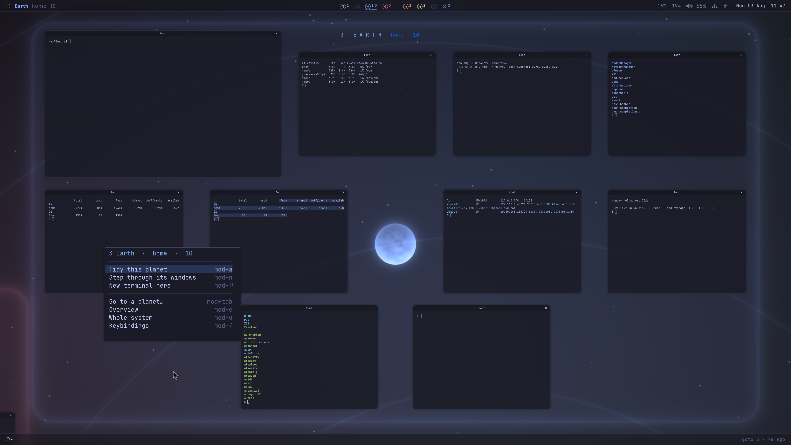

**The footer** is the same bar upside down. The header says where you are; this one says what sol
last did — `arrange 3 · just now` — and it reserves its 28 pixels at the screen edge rather than
floating over your windows.

Press **`mod+;`** and it opens into a command line above itself: any `sol` command, with tab
completion over the subcommands, the planets and the roles. A bare place name is taken as `goto`,
because "jupiter" is what you would type if nobody had told you a verb was expected.

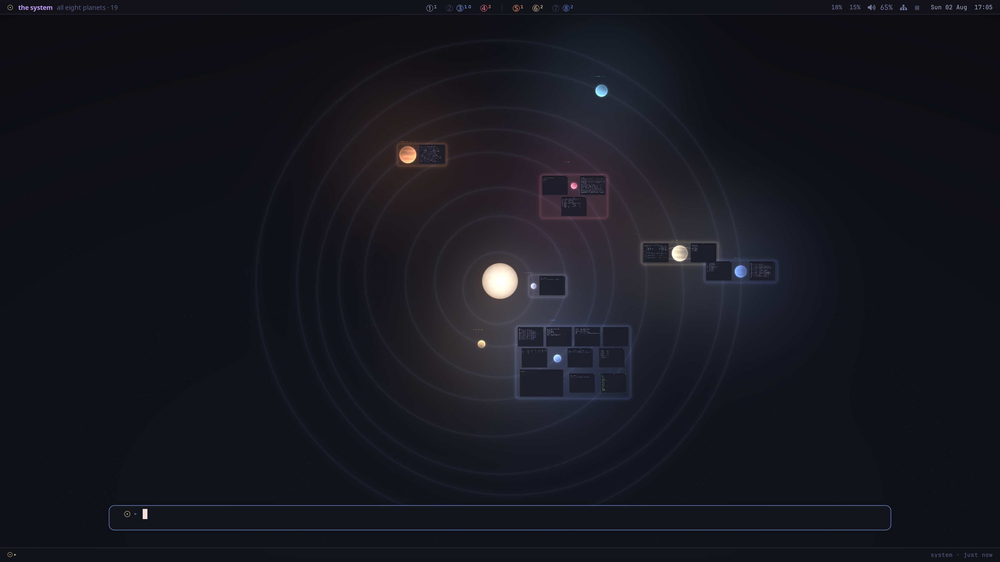

**Name plates** float beside each planet, naming it and counting what it holds — "3  E A R T H
home · 10". They're ordinary windows on purpose: driftwm limits how far you can zoom out to half the
fit of the real windows on the canvas, so the plates are what hold the canvas open wide enough for
the whole-system view to exist — and they double as click-to-fly targets. Keeping the tally live
costs nothing: `sol here`, which the bar already runs once a second, leaves the lines in a file and
each plate just reads its own.

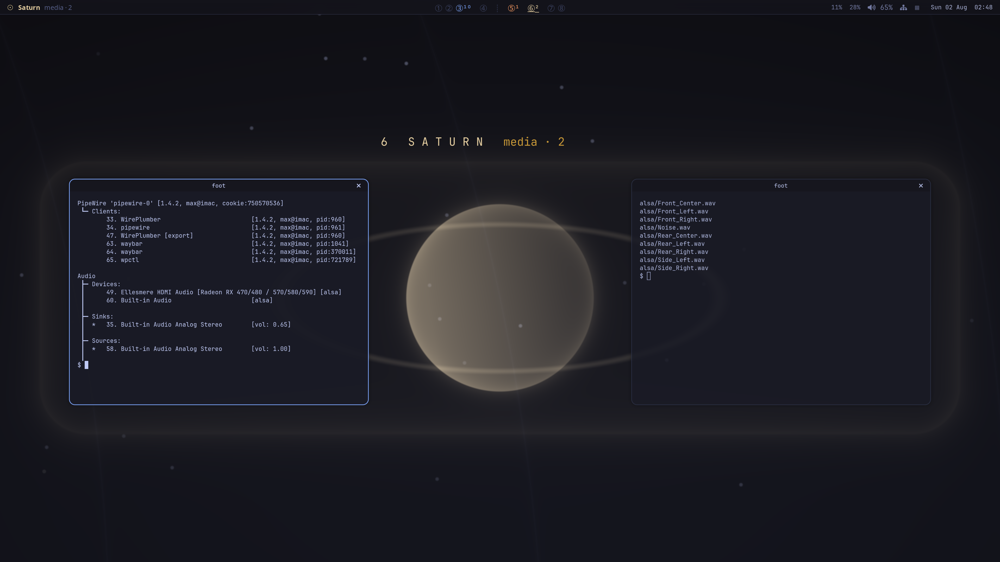

Press `mod+/` for the card, any time:

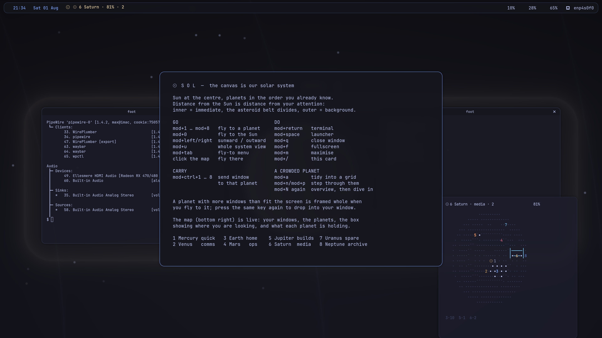

## Install

```sh
git clone https://github.com/bachata-dev/sol
cd sol
./install.sh
```

Then set your display in the `MACHINE-SPECIFIC` block of `~/.config/driftwm/config.toml` (connector
name and HiDPI scale — find yours in `driftwm msg state`) and start driftwm from your display
manager's session list, or on a spare VT:

```sh
sudo driftwm-up          # defaults to VT 3
```

The installer also offers to **boot into sol**: autologin on tty1, and a line in your profile that
hands the console to `sol-session`. It is off by default, because it makes the machine log itself
in — the right trade only when physical access to it already means everything.

It matters for more than convenience. logind grants "restart this machine" to the *active session
on a local seat*, so a desktop started some other way — by a root `systemd-run`, or with a second
desktop still autologging in on another VT — is a desktop whose `☉` menu quietly does nothing when
you click **Restart**. `sol doctor` says so in as many words. If the compositor fails to start,
`sol-session` drops you back to the console prompt with the tail of its log rather than looping.

**Requirements:** [driftwm](https://github.com/malbiruk/driftwm), `foot`, `python3`, `awk`;
`python3-gi` (GTK 3) and `gtk-layer-shell` for the `☉` context menu — without them right-click has
nothing to open and everything else works; optionally `waybar`, `fuzzel`, `mako`; JetBrains Mono
plus a Nerd Font for the bar glyphs.
[Omarchy](https://omarchy.org) keybindings light up automatically if omarchy is installed, and are
harmless if not.

## The `sol` command

Everything the keybindings do is available directly, and the whole toolkit is one command:

```sh
sol goto 4        # or: sol goto mars, sol goto ops, sol goto sun
sol hop out       # next planet outward; `sol hop in` goes sunward
sol system        # frame the whole solar system
sol arrange       # tidy this planet's windows; `sol arrange all` does every one
sol next          # step to the next window here; `sol prev` goes back
sol send 8        # send the focused window to Neptune; `--stay` to not follow
sol gather        # bring every adrift window in; `sol gather 8` files them on Neptune
sol sweep         # drain this planet's stack to the archive; `sol sweep 5 2` names both
sol tour          # a narrated first flight; touch anything and it yields
sol doctor        # is this machine set up right? paste it into bug reports
sol list          # what is where
sol plate 3       # the line Earth's name plate is showing
sol here          # where am I?
sol menu          # the context menu, at the pointer
sol menu system   # the ☉ menu: lock, sleep, restart, shut down, log out
sol menu go       # the switcher: every place, type to filter
sol map           # the overview (runs inside a terminal; sol-map toggles it)
sol bar strip     # one line of the bar — where, holding, strip, or last
sol shift back    # move the focused window a slot along its grid
sol watch         # catch windows dragged between planets (runs from autostart)
sol help          # the keybinding card
```

## Opt-in extras

Nothing below runs unless you turn it on, because each one moves the camera without being asked.

- **`sol-planetarium`** — after four idle minutes, glides the camera in a slow orbit of the system
  (~8 minutes per revolution) and hands it straight back on any key or mouse movement. Add
  `"sol-planetarium"` to `autostart` in the config.
- **`sol-spin`** — draw a circle with the mouse to travel outward (clockwise) or sunward
  (counter-clockwise). Root systemd service, since it reads `/dev/input`:
  `sudo systemctl enable --now sol-spin`. It also stamps input activity, which is how the
  planetarium tells real idleness from you simply not panning.

## Make it yours

- **Different sky** — `python3 tools/sol-positions.py 2027-03-01` solves the orbits for that date and
  prints the planet table for `bin/sol`, the orbit constants for `config/sol.glsl`, and the
  name-plate placements for the config. The layout is a snapshot of the real sky, so you can set it
  to a date that means something.
- **Roles** — the labels ("home", "ops", "builds") are just strings in the autostart lines.
- **Sizes** — every disc comes from one rule in `tools/sol-positions.py`: the cube root of the body's
  real radius, with Earth at 105. Change `EARTH_PX` to scale them all, or the exponent for a
  different compression.
- **Shader** — every colour and coefficient is a named `const` at the top of `sol.glsl`. Saving the
  file is not enough on its own: press `mod+shift+c` to reload the config and the shader comes with
  it. The only lines `sol` ever writes are the district rectangles between the two `── districts ──`
  markers; delete the markers and you simply get no cards.
- **The bar and the menu** — `waybar.jsonc` and `waybar.css` for the bar. The context menu is
  `bin/sol-menu`, and its whole appearance is the CSS block at the top of that file. `fuzzel.ini`
  styles the *switcher* (`mod+tab`) only; delete it and that falls back to whatever fuzzel already
  does.
- **No trackpad?** — `tools/sol-hand.py` is an emulated hand: an absolute mouse, a relative mouse, a
  four-finger touchpad and a keyboard, all through `/dev/uinput`, real enough that libinput runs its
  actual gesture engine over them. Every swipe, pinch, click, drag and keypress above was verified
  with it, over SSH, before it ever met a physical hand.

## What's real, and what isn't

Real: the order, the angles, the eccentricities and the perihelion directions. Each planet is placed
by solving Kepler's equation for the date, so it sits on its own ellipse where it actually was, and
the Sun sits at a focus of all eight.

Two things are deliberately not to scale, because true scale is unusable:

- **Orbit spacing is uniform** — 1000, 1820, 2640 … 6740. In reality Neptune orbits 78× further out
  than Mercury; here it is 6.7×. Even spacing keeps the whole system reachable and makes every hop
  between neighbours take about the same time.
- **Discs are the cube root of the real radii**, scaled so Earth is 105 across. One rule for every
  body, so the ranking is exactly right — Jupiter is the giant, Mercury the pebble, and the Sun
  dwarfs all of it — without the giants swallowing their own orbits. At true scale, with Neptune's
  orbit where it is, Earth would be a hundredth of a pixel.

The two scales are also independent of each other: relative to its own orbit, every planet is drawn
hundreds of times too large. Distance means "how far from what I'm doing", not kilometres.

## Uninstall

```sh
./uninstall.sh    # removes the commands and the daemon; your config stays put
```

It also takes back the boot hook if you asked for one — the profile block and the autologin
drop-in go together, since a console that logs itself in for a desktop that is no longer there is
worse than either alone.

## Status

Developed and daily-driven on Debian 13 with AMD graphics and a 4K display. It should work anywhere
driftwm runs; display scale, fonts, and the `/dev/input` bits are where another machine is most
likely to need a nudge. Issues and PRs welcome.

## Credits

- [driftwm](https://github.com/malbiruk/driftwm) by Klim Kostiuk — the infinite-canvas compositor
  that makes any of this possible
- Several palette hues began in [Tokyo Night](https://github.com/enkia/tokyo-night-vscode-theme) by enkia

## License

GPL-3.0, matching driftwm. See [LICENSE](LICENSE).
