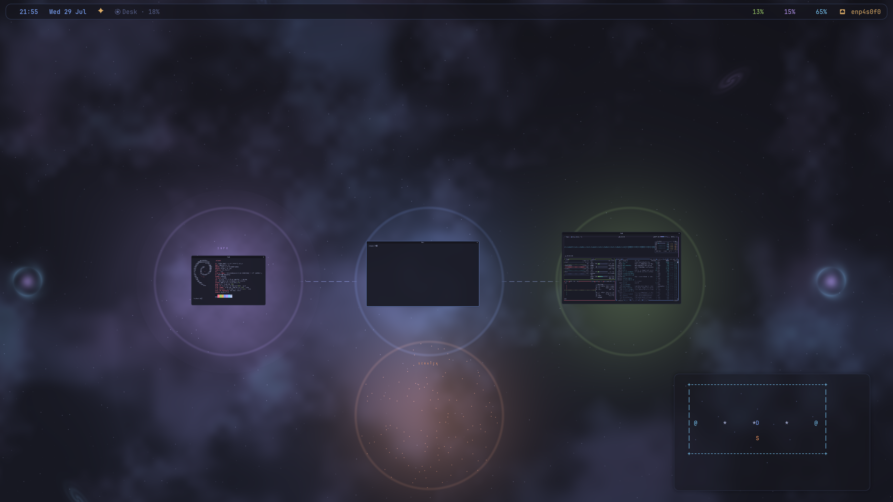
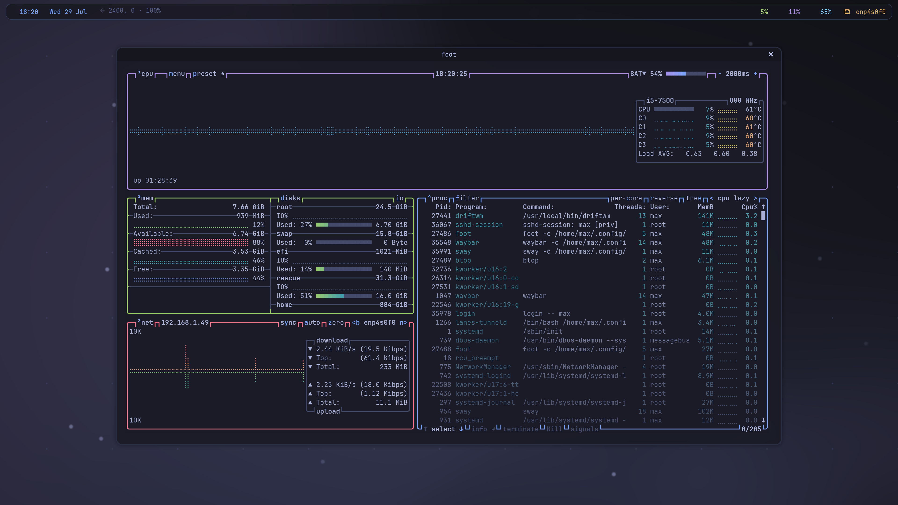

<h1 align="center">sol</h1>

<p align="center">
  <b>Your desktop as a solar system.</b><br>
  A Tokyo Night universe for <a href="https://github.com/malbiruk/driftwm">driftwm</a> —
  the sun burns at your desk, your workspaces are planets, and everything between is GPU-shaded deep space.
</p>


<p align="center"><i>
  Warping to Ops · orbital window hop · universe view · the whole cosmos · through a wormhole and home
</i></p>

---

## Why

[driftwm](https://github.com/malbiruk/driftwm) is an infinite-canvas Wayland compositor: windows live
anywhere on an endless 2D plane and your screen is a camera looking at it. It's a beautiful idea with
one honest problem — **an infinite plane is featureless**. Pan away from your windows and there is
nothing to tell you where you are, which way is home, or where you left that terminal.

`sol` answers that with a *place*. It gives the canvas a sun, orbits, regions with their own
celestial identities, landmarks in deep space, and a star chart in the corner. Navigation stops being
"pan and hope" and becomes flying around somewhere you know.

Everything visual is one GLSL fragment shader — the astronomy costs no windows, no compositing
layers, and no meaningful CPU. Everything behavioral is a small pile of shell and Python talking to
driftwm over its IPC socket.

## The universe

**Sol** burns at your **Desk** region — a flickering golden star with a corona. Everything revolves
around where you actually work.

| Region | Body | Lives at |
|---|---|---|
| **Desk** | Sol, the sun | origin `(0, 0)` |
| **Ops** | green planet with a Saturn ring | orbit r=2400, east |
| **Info** | purple planet inside a breathing nebula | orbit r=2400, west |
| **Scratch** | an asteroid belt | orbit r=1600, south |
| **Gate West / East** | wormhole portals | `(∓4800, 0)` |

Planets are lit by the sun with a real day/night terminator. Moons crawl the orbits in real time, a
comet rides an ellipse with an anisotropic tail, and four distant galaxies sit in deep space as
fixed landmarks.

**Scale strata.** The universe reveals itself as you zoom out and gets out of your way as you zoom
in — powers-of-ten in a single shader:

| Zoom | What you see |
|---|---|
| working zoom | a clean, near-black workspace; astronomy fades to a whisper |
| < 0.8 | region territories bloom; orbits brighten |
| < 0.5 | planets, belt and moons read clearly |
| < 0.34 | a cosmic web of filaments emerges between everything |



## Placement awareness

- **ASTROLABE** — a pinned star-chart HUD (bottom right) plotting your windows `*`, the regions,
  wormhole gates `@` and your current viewport, live. **Click anywhere on the chart to fly there.**
- **A bar that knows where you are** — the waybar module names your region ("Ops", "deep space"…)
  and tints itself that region's color, so you read your location peripherally.
- **Constellation labels** float on the canvas above each region.

## Navigation

| Action | How |
|---|---|
| Universe view (fit all windows) | `mod+u` · the ✦ bar button · click the region module · top-left hot corner |
| Cosmos view (whole universe, gates included) | `mod+shift+u` |
| Warp menu (fly to any region) | `mod+tab` · middle-click empty canvas |
| Jump to region 1–4 | `mod+1` … `mod+4` |
| **Send focused window to a region** | `mod+ctrl+1` … `mod+ctrl+4` |
| **Cycle windows in orbital order** | **draw a circle with the mouse** (clockwise = next) · `mod+o` / `mod+shift+o` · `mod+shift+scroll` |
| Fly to a window from universe view | click it (under 45% zoom, windows become click-to-center) |
| Warp into a window (focus + center + 100%) | middle-click it |
| Cycle shader wallpapers | `mod+ctrl+space` |
| Terminal · launcher · close window | `mod+return` · `mod+space` · `mod+q` |

Window cycling is **spatial, not recency-based**: windows are sorted by their angle around Sol, so
spinning the mouse clockwise walks you clockwise through the solar system. You always know where
you'll land, because you can see it on the astrolabe.

## Motion

- **Flight arcs** — any hop longer than ~1500px zooms out, glides, and zooms back in, Google-Earth
  style, so long journeys read as travel rather than teleportation.
- **Wormholes** — park the camera inside a gate for ~1.2s and you're thrown to the far side of the
  universe.
- **Planetarium idle mode** — after 4 minutes with no input the camera begins a slow, continuous
  orbit of the solar system (~8 min per revolution). Micro-steps at 5 Hz keep the compositor's camera
  interpolation permanently mid-flight, so it glides rather than hops. Any key or mouse movement
  hands the camera straight back.



## Install

```sh
git clone https://github.com/bachata-dev/sol
cd sol
./install.sh
```

The installer backs up any existing `~/.config/driftwm`, installs the companion tools to
`/usr/local/bin`, and asks before enabling the circle-gesture daemon.

Then set your display in the `MACHINE-SPECIFIC` block of `~/.config/driftwm/config.toml` (connector
name + HiDPI scale — find yours in `driftwm msg state`), and start driftwm from your display
manager's session list, or on a spare VT:

```sh
sudo driftwm-up          # defaults to VT 3
```

Bar, labels, astrolabe and daemons all self-assemble from driftwm's autostart.

### Requirements

- [driftwm](https://github.com/malbiruk/driftwm) — this is a configuration and toolkit for it
- Required: `foot`, `fuzzel`, `waybar`, `awk`, `python3` · optional autostart entries: `btop`,
  `fastfetch`, `mako`
- JetBrains Mono, plus a Nerd Font for the bar glyphs
- The circle gesture and the idle detector read `/dev/input` (root systemd service, optional — skip
  it and the planetarium falls back to camera stillness)
- [Omarchy](https://omarchy.org) keybindings (`mod+k`, `mod+escape`, screenshots) light up
  automatically if omarchy is on `PATH`, and are harmless if not

## What's in the box

```
config/    driftwm config, the sol.glsl shader, foot theme, waybar, astrolabe, region registry
bin/       driftwm-warp         fuzzel warp menu with flight arcs
           driftwm-orbit        cycle windows in orbital order around Sol
           driftwm-spin         circle-gesture daemon + input-activity stamp (root)
           driftwm-region       waybar module: current region + zoom, with a CSS class
           driftwm-wormholed    gate dwell detector / teleporter
           driftwm-planetarium  idle orbit
           driftwm-background-next   cycle shader wallpapers
           driftwm-up           launch driftwm on a spare VT
```

## Make it yours

- **Add a region** — append `Name<TAB>x<TAB>y` to `~/.config/driftwm/regions.tsv`; the warp menu, bar
  module and astrolabe pick it up immediately. Give it a body with a `glow()` / `planet()` call in
  the shader, and a floating label in `config.toml`'s autostart.
- **Shader** — every color and coefficient is a named `const` at the top of `sol.glsl`. Edits
  hot-reload on save; a compile error falls back to the dot grid and reports on the error bar.
- **Planetarium pace** — `IDLE_SECS` and `PERIOD` (seconds per revolution) env vars.
- **Gesture feel** — `TURN_RAD`, `MIN_PATH`, `MAX_SPAN` at the top of `bin/driftwm-spin`.

## Uninstall

```sh
./uninstall.sh    # removes the tools and the gesture daemon; your config is left in place
```

## Status

Developed and daily-driven on Debian 13 with AMD graphics and a 4K display. It should work anywhere
driftwm runs, but display scale, fonts and the `/dev/input` bits are where another machine is most
likely to need a nudge. Issues and PRs welcome.

## Credits

- [driftwm](https://github.com/malbiruk/driftwm) by Klim Kostiuk — the infinite-canvas compositor
  that makes any of this possible
- [Tokyo Night](https://github.com/enkia/tokyo-night-vscode-theme) palette by enkia

## License

GPL-3.0, matching driftwm. See [LICENSE](LICENSE).
